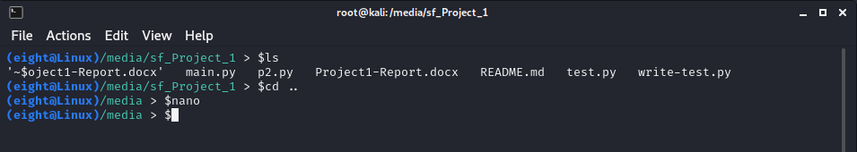

# pyshell-linux

This is a simple shell in python for Unix-based systems.
Implemented for Operating Systems' claas 

## Shell 



# Usage
Open you terminal and change the wworking directory to the pyshell's path.

Enter:
```
python3.10 main.py
```
both of '-' and ',' are ok!  

If you want to run a command concurrently, follow the structure below:
```
[Command] &
```

For instance:
```
python writefile.py &
```  
To exit the shell:
```
exit
```  

## Features:
* Beautiful and simple UI :)
* Concurrent command execution.
* Piping with 2 different methods(file & pipe).
* Input & Output redirection.
* CD Command

# Requirements
python >= 3.10
  


# Authors
MR-EIGHT

